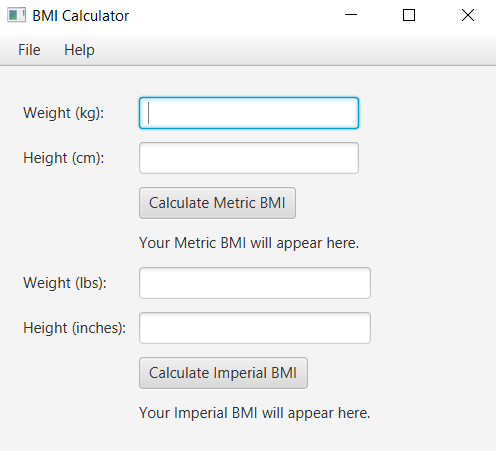
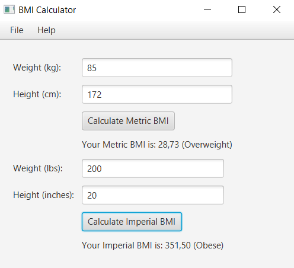
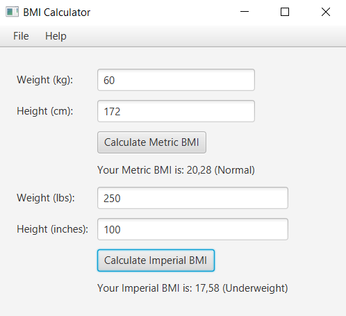

# BMI Calculator Application

## Description
This is a JavaFX-based BMI Calculator that allows users to input their weight and height, and calculates their BMI. The app supports both metric and imperial units.

## Features
- Input fields for weight and height
- BMI calculation
- Displays BMI status (Underweight, Normal, Overweight, Obese)
- Menu for clearing input and exiting the app
- Help menu with usage instructions

## How to Use
1. Input your weight in kilograms or pounds.
2. Input your height in centimeters or inches.
3. Click "Calculate BMI" to see your result.

